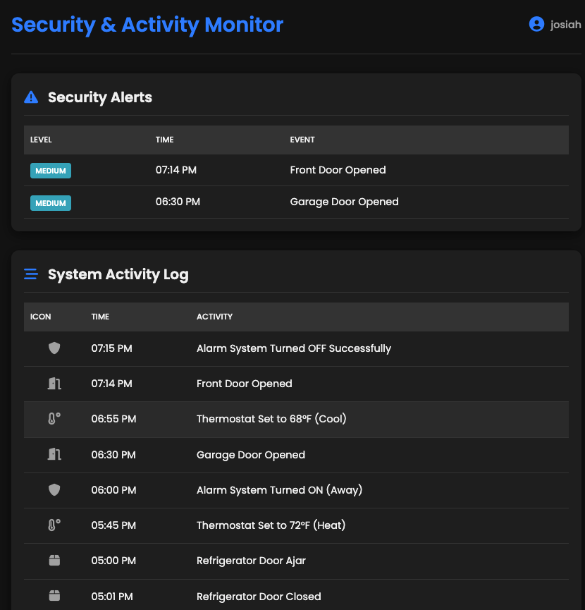
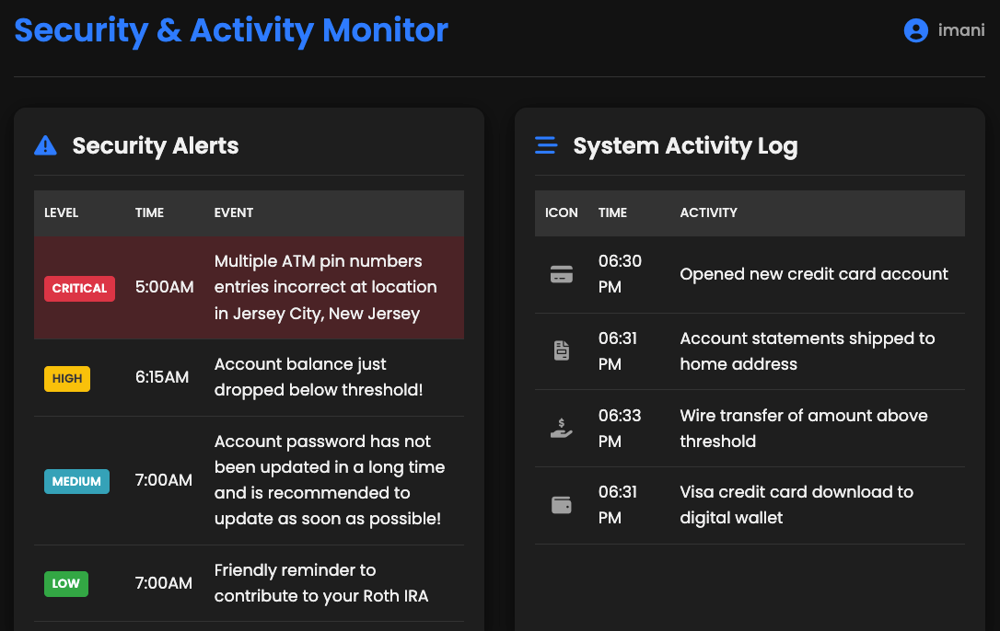

# Alert Showcase

Real Time  alarm-event-streaming-showcase.

This demo uses [RabbitMQ Streams SQL filtering](https://www.rabbitmq.com/blog/2025/09/23/sql-filter-expressions). 
It demonstrates the power of RabbitMQ to deliver high throughput 
messaging with flexible, routing and filtering.

It also demonstrates data ingestion from sourcing such as Internet of things devices 
for various use cases, such as home security and financial real time payment fraud detection.

The applications are implemented using [Spring](https://spring.io/) [Boot](https://spring.io/projects/spring-boot). 
[Spring AI](https://spring.io/projects/spring-ai) is used significantly for integrating real time AI/ML with RabbitMQ SQL filtering.

# Demo Instructions

## IoT Home Security 

See the instructions
- [Iot Home Security Demo Instructions](docs/demo/local/IoT_Alert_SQL.md)

## financial real time payment fraud detection.

See instructions
- [Financial Payment RealTime Fraud Detection Demo Instructions](docs/demo/local/Payments_Alert_SQL.md)

